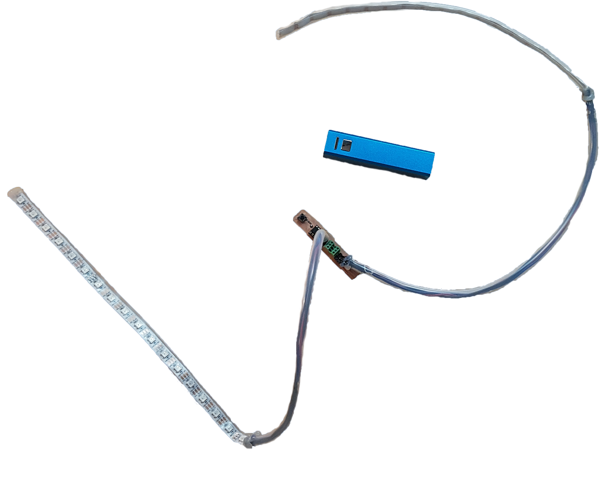
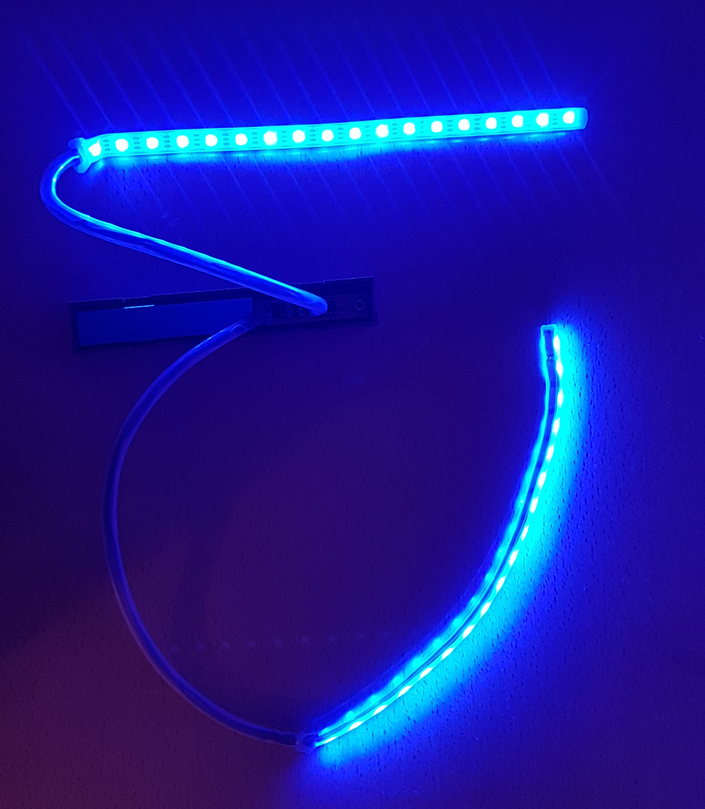
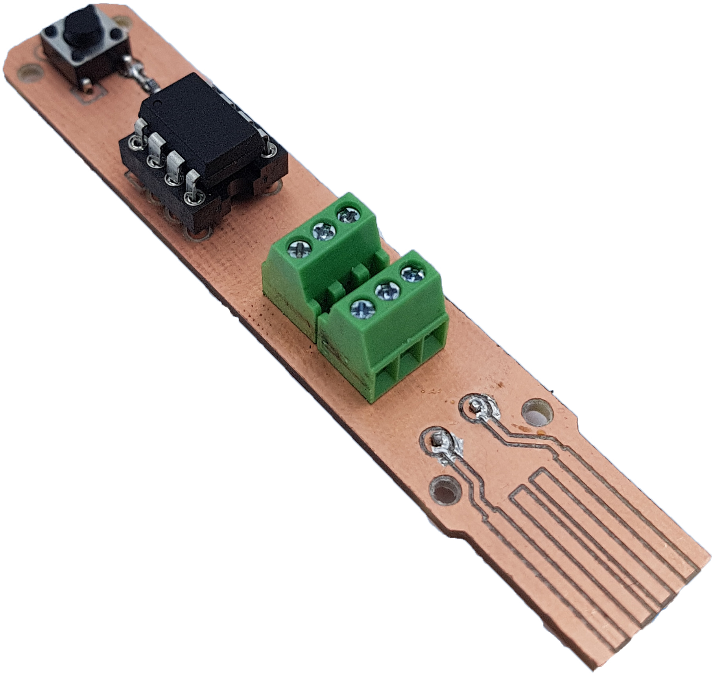

# AVR-C-nano-pixel-led

Experimenting AVR-C for nano pixel LED lights animation.

  
  
  

 

## Required material :

* MCU : [ATtiny85](https://ww1.microchip.com/downloads/en/DeviceDoc/Atmel-2586-AVR-8-bit-Microcontroller-ATtiny25-ATtiny45-ATtiny85_Datasheet.pdf)
* Nanopixel tinsel : [WS2812](https://cdn-shop.adafruit.com/datasheets/WS2812.pdf) (PWM on ATtiny PB0)
* a push button to change the light animations (input on ATtiny PB2)
* breadboard and cables [or make your own PCB like me](#electronic-design)
 

## The program : [main.c](/program/main.c)

Inspired from [Pololu](https://github.com/pololu/pololu-led-strip-avr) works, especially for the led_strip_write function that converts an array of RGB pixel data into a PWM signal for the nano pixel led. In this way, to update a tinsel light sequence, we can modify the value of this array and use this function.

Then, I used trigonometric functions to create periodic and smooth light animations. These functions determine the quantity of each red, green and blue pixel light depending on the time. See bellow the functions bellow (drawn using [Desmos](https://www.desmos.com/calculator))

  

By changing the parameters 𝑎, 𝑏, and 𝑐, we set a phase difference between the curves to randomize RGB combinations. It creates non-periodic light animations. By normalizing the color intensity between 0 and 255, several different combinations of RGB are created from these trigonometric functions.
 

## Electronic design

I chose to design the PCB with a USB port for easy and smart usage. The USB port allows to power supply the system with any USB port, including mobile batteries, computers, ...
Bellow is my PCB. You can find the electronic circuit on it.
From this point of view, GND corresponds to the top pad, and VCC corresponds to the bottom one.:
The power source can be changed with any 5V power supply (with minimum 1A). 

  

[See my PCB files](https://github.com/BrouBrouz/AVR-C-nanopixel-led/tree/main/PCB%20files)
