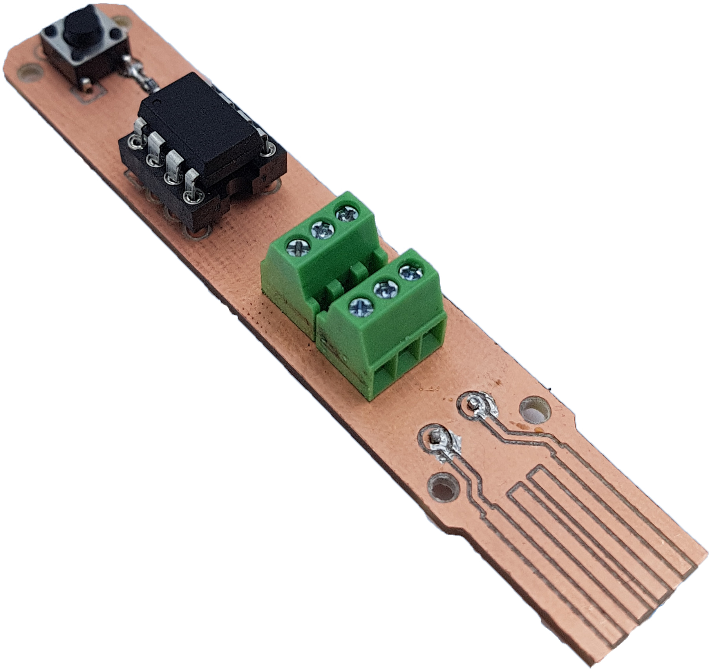

# AVR-C-nano-pixel-led

Experimenting AVR-C for nano pixel LED lights animation + making a custom PCB with a USB port for power supply.

  
  
  

 

## Required material :

* Microcontroller (MCU) : [ATtiny85](https://ww1.microchip.com/downloads/en/DeviceDoc/Atmel-2586-AVR-8-bit-Microcontroller-ATtiny25-ATtiny45-ATtiny85_Datasheet.pdf)
* Nanopixel tinsel : [WS2812](https://cdn-shop.adafruit.com/datasheets/WS2812.pdf) (PWM on ATtiny PB0)
* a push button to change the light animations (input on ATtiny PB2)
* breadboard and cables [or make your own PCB like me](#electronic-design)
 

## The program : [main.c](/program/main.c)

I inspired from [Pololu](https://github.com/pololu/pololu-led-strip-avr) works, especially for the led_strip_write function that I re-used to convert an array of RGB pixel data into a PWM signal for the nano pixel led. In this way, to update a tinsel light sequence, we can modify the values of this array and call this function to send the PWM signal.

Then, I used trigonometric functions to create periodic and smooth light animations. These functions determine the quantity of each red, green and blue pixel light depending on the time. See bellow the functions bellow (drawn using [Desmos](https://www.desmos.com/calculator))

  

By changing the parameters 𝑎, 𝑏, and 𝑐, we set a phase difference between the curves to randomize RGB combinations. It creates non-periodic light animations. By normalizing the color intensity between 0 and 255, several different combinations of RGB are created from these trigonometric functions.
 

An interruption function called "ISR" detects if the button is pushed. We can check if the button is pressed by calling *sei()* in the program. If the button is pushed, the program changes its loop function. In other words, it switches from a light animation to another. There are 4 lighting animations in my program:
1. Mix
2. Smooth
3. Dynamic
4. SOS

Thanks to register programming, the final size of the uploaded program is only 1408 bits which is relatively low. With classical programming and the usage of libraries, the program may have been five times heavier and exceeded 1408 bits only with the libraries' storage.

## Electronic design

I chose to design the PCB with a USB port for easy and smart usage. The USB port allows to power supply the system with any USB port, including mobile batteries, computers, ... 
You can find bellow the electronic circuit on the PCB. For the MCU, I set:
* Pin 5 (PB0) as the output pin for the PWM signal.
* Pin 7 (PB2) to get the signal input of the push-button.

From this point of view, GND corresponds to the top pad, and VCC corresponds to the bottom one.:
The power source can be changed with any 5V power supply (with minimum 1A).

  

[See my PCB files](https://github.com/BrouBrouz/AVR-C-nanopixel-led/tree/main/PCB%20files)

## How to upload an AVR-C program on ATtiny85 using Arduino in ISP programmer mode

A difficulty encountered was uploading a program on ATtiny85. I used a programmer to do it: an Arduino UNO in ISP programmer mode.
An Arduino board can serve to program AVR microcontrollers such as ATtiny85. But the Arduino board needs to be set in ISP mode (ISP stands for "In-System-Programmer").
 
Below are the three main steps to proceed [(click here for more details)](https://www.instructables.com/How-to-Program-an-Attiny85-From-an-Arduino-Uno/) :

1. Using Arduino IDE, the first step consists of setting the Arduino UNO board in ISP mode with only the Arduino board connected to a computer by USB.
2. The second step is connecting the Arduino board to the MCU. The connections can differ from the MCU. These are the connection for the ATtiny85 : [ISP setup for Arduino to ATtiny85](https://www.google.com/url?sa=i&url=https%3A%2F%2Fcreate.arduino.cc%2Fprojecthub%2Farjun%2Fprogramming-attiny85-with-arduino-uno-afb829&psig=AOvVaw1LI-xi0aMTc-Olqpud-ztH&ust=1640971396351000&source=images&cd=vfe&ved=0CAsQjRxqFwoTCLDxjPyEjPUCFQAAAAAdAAAAABAJ). A 10 uF capacitor connected to GND and RESET on the Arduino is essential to place: it short-circuits the Arduino micro-controller to prevent its restarting.
3. The last step is to upload the program: these are the three commands to execute on a Linux terminal, at the main.c path, where main.c is the program to upload.
- avr-gcc -Wall -g -Os -mmcu=attiny85 -o main.bin main.c 
- avr-objcopy -j .text -j .data -O ihex main.bin main.hex 
- avrdude -c stk500v1 -p attiny85 -P /dev/ttyACM0 -b 19200 -U flash:w:main.hex 
